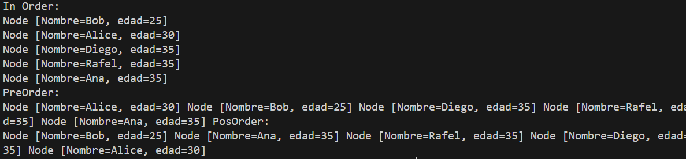
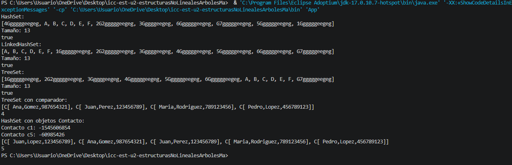
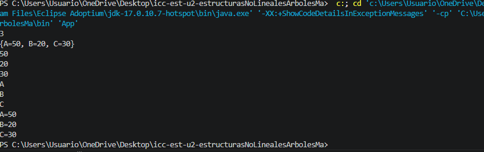

 Práctica: Estructuras no lineales Arboles

## Datos del Estudiante 
- **Nombre:** Martin Amaya
- **Curso:** grupo 3
- **Fecha:** 16/06/2026

---

## 1. IntTree

**Descripción:** 
Se observó una clase teórica previa sobre Arboles y estructuras no lineales, después se procedió a ejecutar dicha teoria en un proyecto nuevo sobre nodos enteros de un arbol, se analizó y realizó los metodos de preOrder, posOrder e inOrder

- **Nombre:** Martin Amaya
- **Curso:** grupo 3
- **Fecha:** 17/06/2026
## 2. BinaryTree

**Descripcion**
En este avance se creó la clase Person y la clase BinaryTree. A partit de aqui se creó un arbol que almacena obejtos de tipo persona. Una cualidad del BinaryTree es que alamcena datos genericos y se preocedió a validar las personas y se comparó por la edad, si coincidia en edad pasaba a comparar el otro atributo que era el nombre.

- **Nombre:** Martin Amaya
- **Curso:** grupo 3
- **Fecha:** 24/06/2026

## 3. Sets

**Descripcion**

Creamos dos clases uno llamado Set y otro Contacto, en Sets, se analizo y aprendio como funcionan las estructuras de Hash, HashSet, LinckedHashSet, SetTree haciendo cambios y vairas pruebas para entender a profundidad.

- **Nombre:** Martin Amaya
- **Curso:** grupo 3
- **Fecha:** 25/06/2026

## 4. Maps

**Descripcion**

Se creo la clase Maps, Se realizo su creacion de metodos para construir tanto un HashMap como un TreeHashMap, y a parte de un coLinkedHashMap

