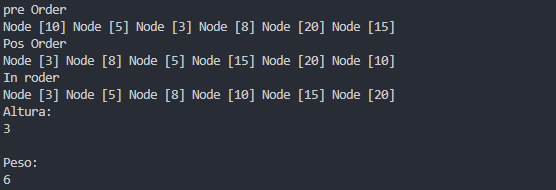

 Práctica: Estructuras no lineales Arboles

## Datos del Estudiante
- **Nombre:** Martin Amaya
- **Curso:** grupo 3
- **Fecha:** 16/06/2026

---

## 1. icc-est-u2-estructurasnoLinealesMa

**Descripción:** 

