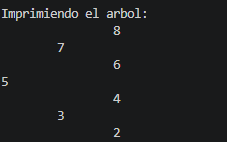
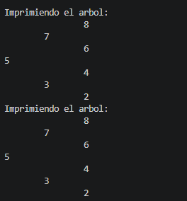
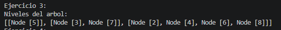
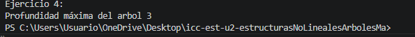

# Practica en Clases 2.2

## Datos del Estudiante
- **Nombre:** Martin Amaya
- **Curso:** Grupo 3
- **Fecha:** 22/06/2026

---

# Ejercicio 1

```
public void insert(int[] numeros){
        BinaryTree<Integer> tree = new BinaryTree<>();

        for(int numero : numeros){
            tree.insert(numero);
        }
        printTree(tree.getRoot());
    }
```
El metodo insert recibe un arreglo de numeros enteros, crea un objeto BinaryTree y se usa un bucle for-each para insertar cada numero del arreglo dentro del arbol. despues llama al printTree para que imprima el arbol ya con los numeros insertados.

```
private void printTree(Node<Integer> root) {
        System.out.println("\nImprimiendo el arbol: ");
        printTreeRecursive(root, 0);
    }

```
Este metodo lo que hace es iniciar la impresion del arbol, primero indica que esta imprimiendo el arbol y seguido llama a otro metodo el cual se encarga de mostrar el arbol con la raiz y el nivel como parametros

```
private void printTreeRecursive(Node<Integer> current, int nivel){
        if(current == null){
            return;
        }
        printTreeRecursive(current.getRight(), nivel + 1);
        for( int i = 0; i < nivel; i++){
            System.out.print("\t");
        }
        System.out.println(current.getValue());
        printTreeRecursive(current.getLeft(), nivel + 1);
    }

```
Y por ultimo, este metodo se encarga de imprimir un arbol binario usando el nivel para que se vea como el formato indicado y lo hace de manera recursiva. Lo que hace es recorrer el subarbol derecho, luego muestra el nodo actual y para que se vea como un arbol se usa tabulacion de aceurdo al nivel y para finalizar recorre el subarbol izquierdo.

### Salida en consola




# Ejercicio 2

```
public Node<T> invert(Node<T> root){
     
        invertRecursively(root);

        printTree(root);

        return root;
    }

```
Este metodo convierte un arbol binario al reves, es decir lo invierte, lo hace llamando a un metodo recursivo que cambia la rama izquierda y derecha. procede a imprimir el arbol invertido y finaliza devolviendo la raiz de este arbol al reves.

```
 private void invertRecursively(Node<T> root) {
        if(root == null){
            return;
        }

        Node<T> temp = root.getLeft();
        root.setLeft(root.getRight());
        root.setRight(temp);

        invertRecursively(root.getLeft());
        invertRecursively(root.getRight());
    }

```
Este metodo invierte el arbol binario ya que cambia a los subarboles izquierdo y derecho de cada nodo. si es null hace un return y acaba, pero si es diferente de null guarda al izquierdo en una variable temporal, luego se asigna al derecho en el izquierdo y al ultimo se pone al temporal en el derecho y asi se realiza el cambio de izquiera a derecha y viceversa.

```
private void printTree(Node<T> root) {
        System.out.println("Imprimiendo el arbol: ");
        printTreeRecursive(root, 0);
    }

```
Este metodo como en el anterior ejercicio lo que hace es iniciar la impresion del arbol. Imprime un mensaje dando a entender que esta yendo a mostrar el arbol y seguido llama al metodo que imprime recursivamente, y envia la raiz y el nivel

```
 private void printTreeRecursive(Node<T> current, int nivel) {
        if(current == null){
            return;
        }
        printTreeRecursive(current.getRight(), nivel + 1);

        for(int i = 0; i < nivel; i++){
            System.out.print("\t");
        }
        System.out.println(current.getValue());
        printTreeRecursive(current.getLeft(), nivel + 1);
    }

```

Este ejercicio acaba con este metodo que hace la impresion del arbol como antes de manera recursiva usando el nivel para que cumpla con el formato que se asigno en clases, recorre el el suarbol derecho, imprime el nodo actual con las respectivas tabulaciones dependiendo el nivel y por ultimo recorre el subarbol izquierdo


### Salida en consola




# Ejercicio 3
```
public List<List<Node<T>>> listLevels(Node<T> root) {
        List<List<Node<T>>> resultado = new ArrayList<>();

        if (root == null) {
            return resultado;
        }

        Queue<Node<T>> queue = new LinkedList<>();
        queue.offer(root);

        while (!queue.isEmpty()) {
            int size = queue.size();
            List<Node<T>> level = new LinkedList<>();

            for (int i = 0; i < size; i++) {
                Node<T> actual = queue.poll();
                level.add(actual);

                if (actual.getLeft() != null) {
                    queue.offer(actual.getLeft());
                }

                if (actual.getRight() != null) {
                    queue.offer(actual.getRight());
                }
            }

            resultado.add(level);
        }

        return resultado;
    }

```
Este metodo junta todos los nodos de un arbol y los separa dependiendo el nivel de profundidad que tengan. Primero verifica si la raiz es nulla, sino usa una cola para procesar los nodos.

### Salida en consola



# Ejercicio 4
```
 public int maxDepth(Node<T> root){
        return alturaRecursivo(root);
    }

```
En este metodo se usa para hacer el calculo de profundidad maxima de un arbol binario. Recibe el nodo raiz y llama al metodo siguiente alturaRecursivo, que devuelve un numero que se calcula aqui internamente.

```

private int alturaRecursivo(Node<T> actual){
        if(actual == null)
            return 0;
        int alturaIzquierda = alturaRecursivo(actual.getLeft());
        int alturaDerecha = alturaRecursivo(actual.getRight());

        return Math.max(alturaIzquierda, alturaDerecha)+1;

    }

```
Y por ultimo, este metodo determina la altura de un arbol usando la recursividad, si el nodo raiz es igual a nulo entonces retorna 0, sino es el caso, realiza llamadas recursivas para calcular la altura del subarbol izquierdo y derecho. Como ultimo paso, se usa la funcion Math.max para comparar ambas alturas, selecciona la rama mas profunda y le suma 1, y retorna este numero o valor hacia los niveles superiores.

### Salida en consola



